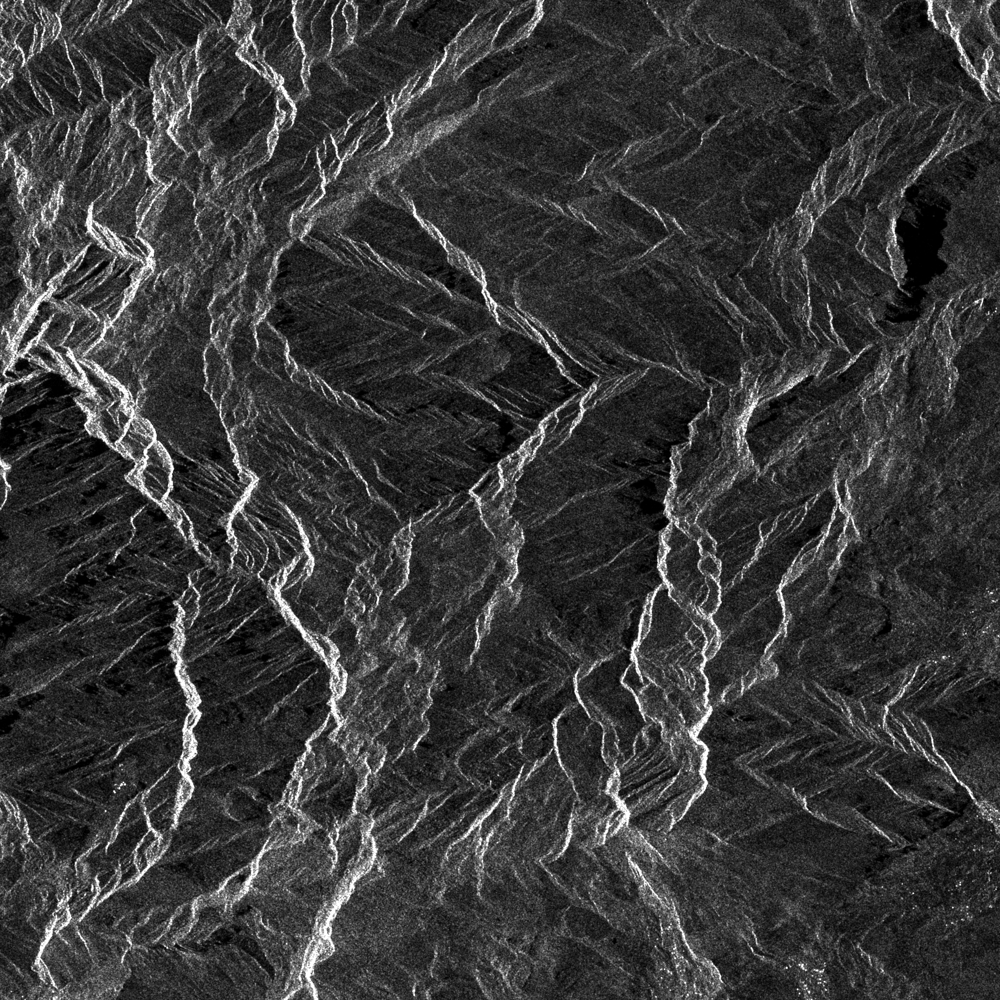
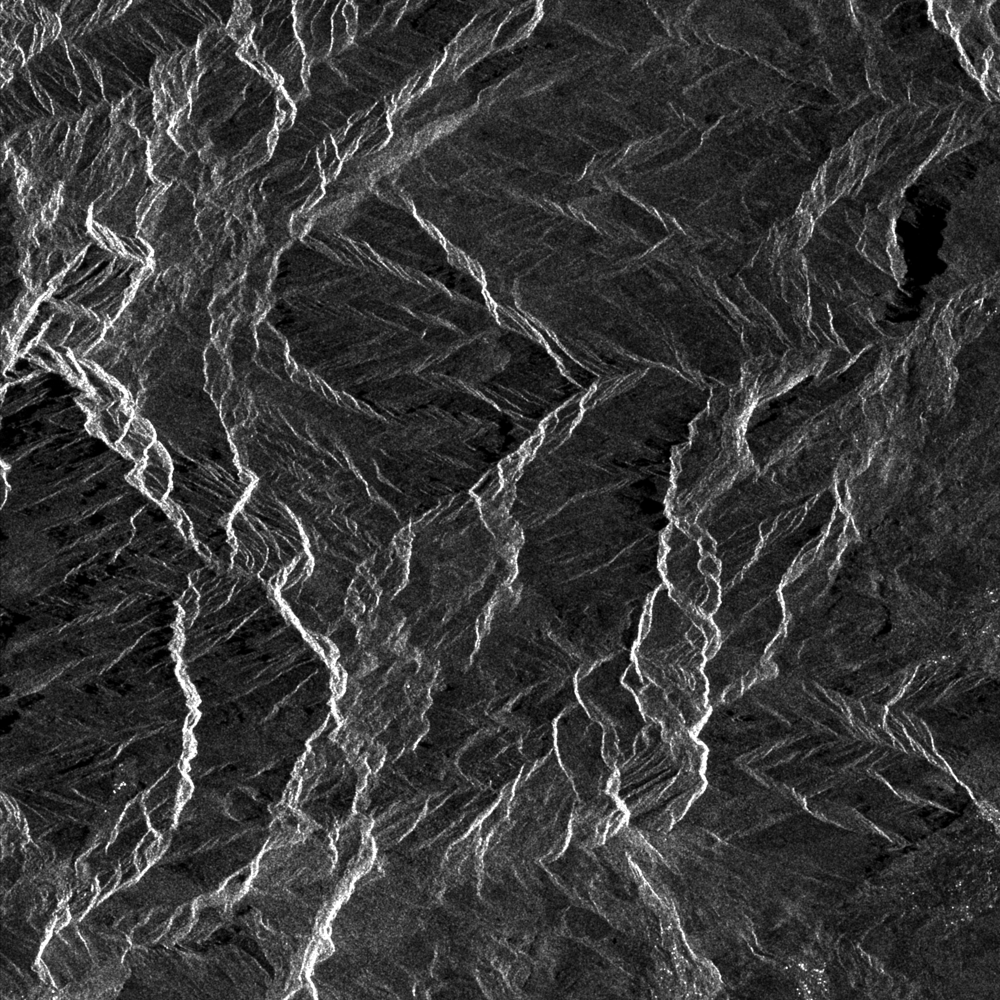
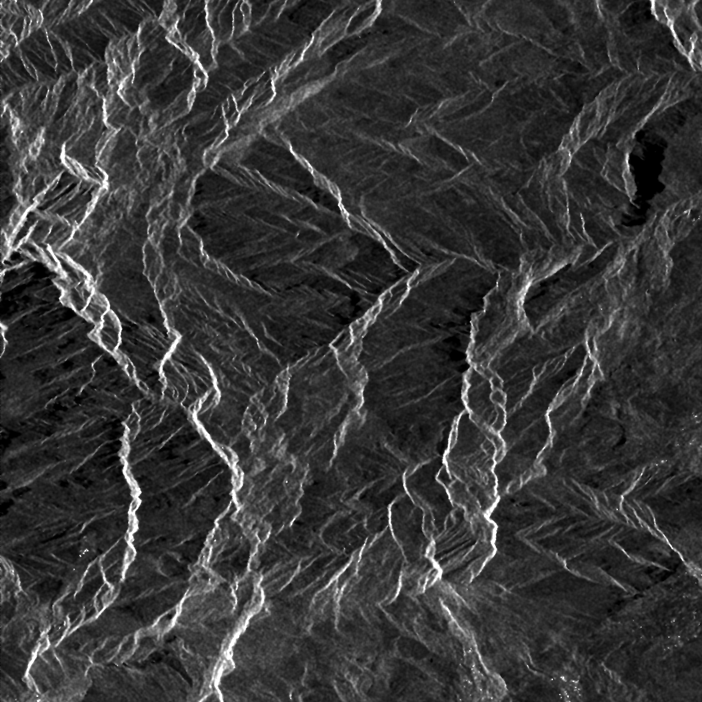
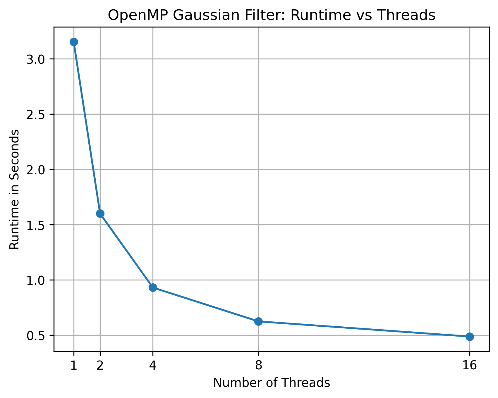
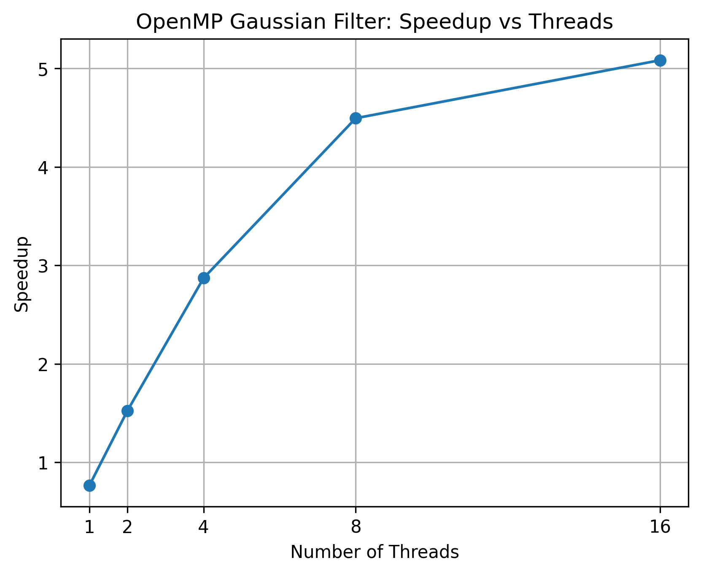
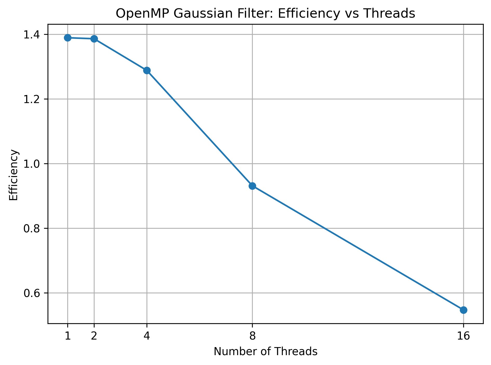

# Parallele Bildverarbeitung für Sentinel-1 SAR-Bilder mit OpenMP

Dieses Repository enthält den Code, die Dokumentation und die Benchmark-Ergebnisse für die Belegaufgabe **„Parallele Bildverarbeitung für Sentinel-1 SAR-Bilder mit OpenMP“** im Kurs **Parallel Systems** an der HTW Berlin im Sommersemester 2026.

Ziel des Projekts ist die Entwicklung und Analyse einer parallelen Bildverarbeitungspipeline für große Sentinel-1 SAR-Bilder. Der Schwerpunkt liegt auf der Umsetzung und Bewertung verschiedener OpenMP-Parallelisierungsstrategien für Filteroperationen auf Bilddaten.

Sentinel-1 SAR-Bilder enthalten typischerweise Speckle-Rauschen und können sehr groß sein. Dadurch eignen sie sich gut als realistischer Anwendungsfall für datenparallele Verarbeitung mit Shared-Memory-Parallelisierung.


Aufgaben des Projekts sind:

- a. Direktes Laden einer Sentinel-1-TIFF-Datei mit GDAL
- b. Implementierung eines sequenziellen Gaussian-Filters als Baseline
- c. Implementierung einer parallelen OpenMP-Version
- d. Vergleich verschiedener OpenMP-Scheduling-Strategien
- e. Benchmarking mit unterschiedlichen Bildgrößen, Kernelgrößen und Thread-Anzahlen
- f. Analyse von Laufzeit, Speedup, Effizienz, Speicherverbrauch und maximal verarbeitbarer Problemgröße
- g. Optionale Erweiterung: Implementierung eines SAR-spezifischen Lee-Filters zur Speckle-Reduktion
- h. Optionale Erweiterung: Vergleich der Laufzeit auf unterschiedlichen Hardware-Systemen

Die Hauptbenchmarks sollen auf einem festen System durchgeführt werden, damit die Ergebnisse vergleichbar bleiben. Ein zusätzlicher Vergleich auf mehreren Laptops kann optional durchgeführt werden, um den Einfluss unterschiedlicher Hardware zu zeigen.

| Laptop | Prozessor | RAM  |
| ------ | --------- | --- |
| 1 | Intel(R) Core(TM) i7-10870H CPU @ 2.20GHz, 8 Kerne, 16 logische Prozessoren | 32.0 GB |

Es werden folgende Vergleichsvarianten betrachtet:

| Variante | Name                 | Aufgabe                                   |
| -------- | ----------------------- | ------------------------------------------- |
| 1        | Sequenzielle Baseline      |  Gaussian-Bildfilter ohne OpenMP; ein Thread verarbeitet das gesamte Bild  |
| 2        | OpenMP parallel for |  Parallelisierung der äußeren Bildschleife, z. B. zeilenweise Verarbeitung |
| 3        | OpenMP Scheduling-Vergleich |  Vergleich von `static`, `dynamic` und `guided` für die parallele Bildschleife             |
| 4        | Optional: Tiling / Blocking | Blockbasierte Verarbeitung zur Untersuchung von Cache-Verhalten und Speicherzugriffen |

## Ergebnisse

<!---
Die folgenden Abbildungen werden später ergänzt:
- Vergleich zwischen Originalbild und gefiltertem Bild
- Laufzeitdiagramm in Abhängigkeit von der Thread-Anzahl
- Speedup-Diagramm
- Effizienz-Diagramm
- Laufzeitvergleich der Scheduling-Strategien
-->

### Sequenzielle Baseline

<!---
| Filter | Bildgröße | Kernel | Scheduling | Laufzeit |
| ------ | --------: | -----: | ---------- | -------: |
| Gaussian | 26562 x 16681 | 3x3 | none | 2.551 s |
-->

| Filter | Bildgröße | Kernel | Scheduling | Laufzeit (min) | Laufzeit (mean ± stddev) |
| ------ | --------: | -----: | ---------- | --------------: | ------------------------: |
| Gaussian | 26562 x 16681 | 3x3 | none | 2.802 s | 2.978 s ± 0.243 s |

*Alle Werte basieren auf 5 Wiederholungen; für Speedup/Effizienz wird jeweils die schnellste Laufzeit (min) verwendet, da Rauschen die Laufzeit nur verlängern, nie verkürzen kann.*

### Vergleich zwischen Originalbild und gefiltertem Bild

Da das vollständige verarbeitete Bild sehr groß ist, wird für die visuelle Darstellung ein automatisch ausgewählter Ausschnitt mit sichtbarer Bildstruktur verwendet. Die gezeigten Bilder stammen direkt aus der ursprünglichen Sentinel-1-VV-TIFF-Datei und aus dem vom C/OpenMP-Programm erzeugten gefilterten TIFF. Der Ausschnitt hat eine Größe von `2048 x 2048` Pixeln. Die Benchmarks selbst werden weiterhin auf dem vollständigen Bild (`26562 x 16681`) durchgeführt.

<table width="100%">
  <tr>
    <td width="33%"></td>
    <td width="33%"></td>
    <td width="33%"></td>
  </tr>
  <tr>
    <td>Original</td>
    <td>Gaussian-Filter</td>
    <td>Lee-Filter</td>
  </tr>
</table>

### OpenMP-Thread-Skalierung

<table width="100%">
  <tr>
    <td width="33%"></td>
    <td width="33%"></td>
    <td width="33%"></td>
  </tr>
  <tr>
    <td>Runtime vs Threads</td>
    <td>Speedup vs Threads</td>
    <td>Efficiency vs Threads</td>
  </tr>
</table>

<!---
| Filter | Bildgröße | Kernel | Threads | Scheduling | Laufzeit | Speedup | Effizienz | Speicher |
| ------ | --------: | -----: | ------: | ---------- | -------: | ------: | --------: | -------: |
| Gaussian | 26562 x 16681 | 3x3 | 1 | static | 1.616 s | 1.095 | 1.095 | 5070.66 MB |
| Gaussian | 26562 x 16681 | 3x3 | 2 | static | 0.832 s | 2.127 | 1.064 | 5070.66 MB |
| Gaussian | 26562 x 16681 | 3x3 | 4 | static | 0.442 s | 4.005 | 1.001 | 5070.66 MB |
| Gaussian | 26562 x 16681 | 3x3 | 8 | static | 0.331 s | 5.347 | 0.668 | 5070.66 MB |
| Gaussian | 26562 x 16681 | 3x3 | 16 | static | 0.235 s | 7.532 | 0.471 | 5070.66 MB |
-->

| Filter | Bildgröße | Kernel | Threads | Scheduling | Laufzeit (min) | Laufzeit (mean ± stddev) | Speedup | Effizienz |
| ------ | --------: | -----: | ------: | ---------- | --------------: | ------------------------: | ------: | --------: |
| Gaussian | 26562 x 16681 | 3x3 | 1 | static | 2.775 s | 2.826 s ± 0.048 s | 1.010 | 1.010 |
| Gaussian | 26562 x 16681 | 3x3 | 2 | static | 1.459 s | 1.921 s ± 0.044 s | 1.920 | 0.960 |
| Gaussian | 26562 x 16681 | 3x3 | 4 | static | 0.845 s | 0.858 s ± 0.012 s | 3.316 | 0.829 |
| Gaussian | 26562 x 16681 | 3x3 | 8 | static | 0.526 s | 0.589 s ± 0.066 s | 5.327 | 0.666 |
| Gaussian | 26562 x 16681 | 3x3 | 16 | static | 0.514 s | 0.522 s ± 0.005 s | 5.451 | 0.341 |

### Bildgrößenvergleich

| Filter | Bildgröße | Threads | Scheduling | Laufzeit | Speicher |
| ------ | --------: | ------: | ---------- | -------: | -------: |
| Gaussian | 2048 x 2048 | 8 | static | offen | offen |
| Gaussian | 4096 x 4096 | 8 | static | offen | offen |
| Gaussian | 8192 x 8192 | 8 | static | offen | offen |
| Gaussian | 26562 x 16681 | 8 | static | 0.625 s | 1267.66 MB |

### Scheduling-Vergleich

<!---
| Filter | Bildgröße | Kernel | Threads | Scheduling | Laufzeit | Speedup | Effizienz |
| ------ | --------: | -----: | ------: | ---------- | -------: | ------: | --------: |
| Gaussian | 26562 x 16681 | 3x3 | 8 | static | 0.329 s | 5.380 | 0.672 |
| Gaussian | 26562 x 16681 | 3x3 | 8 | dynamic | 0.261 s | 6.782 | 0.848 |
| Gaussian | 26562 x 16681 | 3x3 | 8 | guided | 0.299 s | 5.920 | 0.740 |
-->

Für den Scheduling-Vergleich wird eine feste Bildgröße, ein fester Kernel und eine feste Thread-Anzahl (8) verwendet. Verglichen werden die OpenMP-Scheduling-Strategien `static`, `dynamic` und `guided`.

| Filter | Bildgröße | Kernel | Threads | Scheduling | Laufzeit (min) | Laufzeit (mean ± stddev) | Speedup | Effizienz |
| ------ | --------: | -----: | ------: | ---------- | --------------: | ------------------------: | ------: | --------: |
| Gaussian | 26562 x 16681 | 3x3 | 8 | static | 0.526 s | 0.545 s ± 0.033 s | 5.327 | 0.666 |
| Gaussian | 26562 x 16681 | 3x3 | 8 | dynamic | 0.521 s | 0.533 s ± 0.010 s | 5.378 | 0.672 |
| Gaussian | 26562 x 16681 | 3x3 | 8 | guided | 0.516 s | 0.527 s ± 0.007 s | 5.430 | 0.679 |

`guided` performt hier am besten, gefolgt von `dynamic`, dann `static` — konsistent mit einem früheren Testlauf auf derselben Maschine. Dies ist etwas überraschend, da die Zeilen des Bildes annähernd gleich teuer zu verarbeiten sind, wodurch `static` theoretisch keinen Lastungleichgewicht-Nachteil haben sollte. Eine plausible Erklärung ist, dass auf einer Laptop-CPU mit Turbo-Boost und thermischer Drosselung einzelne Kerne zeitweise langsamer laufen; `dynamic`/`guided` können sich daran anpassen, `static`s feste Vorab-Zuteilung nicht.

### Kernel-Größenvergleich

Für den Kernel-Größenvergleich wird eine feste Bildgröße und eine feste Thread-Anzahl (8, schedule=static) verwendet. Die Gaussian-Kernel werden aus den Binomialkoeffizienten des Pascal'schen Dreiecks erzeugt — ein Standardverfahren zur Konstruktion diskreter Gauß-Approximationen, das für 3x3 exakt den ursprünglich verwendeten Kernel reproduziert.

| Filter | Bildgröße | Kernel | Threads | Scheduling | Sequenziell (min) | OpenMP (min) | Speedup | Effizienz |
| ------ | --------: | -----: | ------: | ---------- | ------------------: | ------------: | ------: | --------: |
| Gaussian | 26562 x 16681 | 3x3 | 8 | static | 2.956 s | 0.541 s | 5.464 | 0.683 |
| Gaussian | 26562 x 16681 | 5x5 | 8 | static | 7.657 s | 1.162 s | 6.589 | 0.824 |
| Gaussian | 26562 x 16681 | 7x7 | 8 | static | 14.522 s | 2.186 s | 6.643 | 0.830 |

Die Effizienz steigt mit der Kernelgröße (0.683 → 0.824 → 0.830). Dies ist plausibel: größere Kernel bedeuten mehr Rechenaufwand pro Pixel, wodurch sich der fixe Overhead der OpenMP-Parallelisierung (Thread-Erzeugung, Scheduling) über mehr Nutzarbeit verteilt.

## Interpretation
Die Interpretation wird nach Durchführung der Benchmarks ergänzt.

## Getting Started

### Datensatz

Die originalen Sentinel-1-Daten werden nicht im Repository gespeichert, da die Dateien sehr groß sind.

Für die Benchmarks wird ein Sentinel-1 SAR-Bild aus dem [Copernicus Browser](https://dataspace.copernicus.eu/data-collections/copernicus-sentinel-missions/sentinel-1) verwendet. 

Die Schritte zum Herunterladen und Vorbereiten der Sentinel-1-Daten sind in der Datei [`data/README.md`](data/README.md) beschrieben.
Für die aktuelle Benchmark-Version wird die VV-Polarisation eines Sentinel-1-Level-1-GRD-Produkts verwendet. Die TIFF-Messdatei wird direkt mit GDAL im C-Programm eingelesen.

Die ursprünglichen Pixelwerte werden von GDAL in einen Float32-Arbeitspuffer übertragen und anschließend vom sequenziellen beziehungsweise parallelen Filter verarbeitet. Eine vorherige Konvertierung in das PGM-Format ist nicht mehr notwendig.

### Dependencies

Für die Python-Hilfsskripte:
- Python 3.10+
- NumPy
- Matplotlib
- ImageIO
- Pandas

Für die C/OpenMP-Anwendung:
- GCC mit OpenMP-Unterstützung
- GDAL
- Unter Windows: MSYS2/UCRT64

### Installing

Repository klonen:

```bash
git clone url
cd 
```

### C/OpenMP-Programm kompilieren & ausführen

```bash
gcc -O2 -Wall -Wextra -fopenmp src/main.c src/image_io.c src/filters.c src/benchmark.c -o main.exe -lgdal -lm
./main.exe "data/sentinel_datei.tiff"
```

Das Programm führt aktuell den sequenziellen Gaussian-Filter und die OpenMP-Version aus. Dabei werden die Ausgabebilder und Benchmark-Ergebnisse erzeugt:

```text
output/gaussian_seq.tif
output/gaussian_omp.tif
results/benchmark_results.csv
```

### Plots erzeugen

```bash
python scripts/plot_results.py
```

Die erzeugten Plots werden im Ordner `results/` gespeichert:

```text
results/runtime_vs_threads.png
results/speedup_vs_threads.png
results/efficiency_vs_threads.png
```

## Authors 
Houman Safiri HTW Berlin (M.Sc. Applied Computer Science) <br />
Nechirvan Haso Sodo Domili HTW Berlin (M.Sc. Applied Computer Science) <br />
Sarra Malek HTW Berlin (M.Sc. Applied Computer Science) 


## License  

This project is licensed under the MIT License.

## Acknowledgments

- OpenMP Scheduling overview: https://610yilingliu.github.io/2020/07/15/ScheduleinOpenMP/
- S1 Products:  https://sentiwiki.copernicus.eu/web/s1-products
- https://gdal.org/en/stable/download.html
